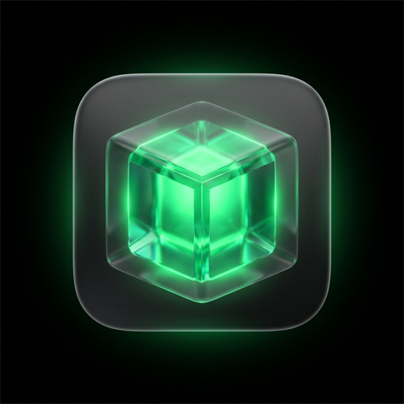
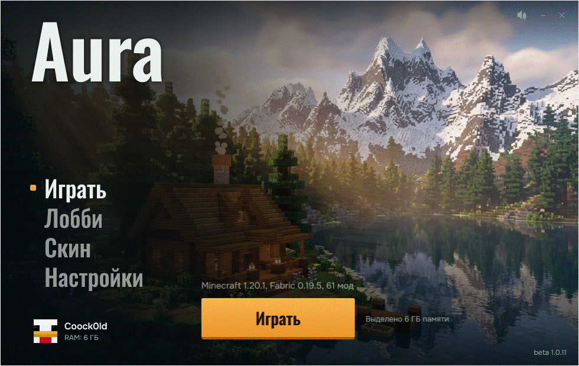
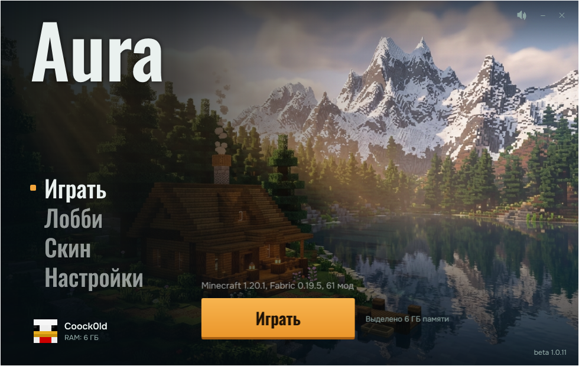
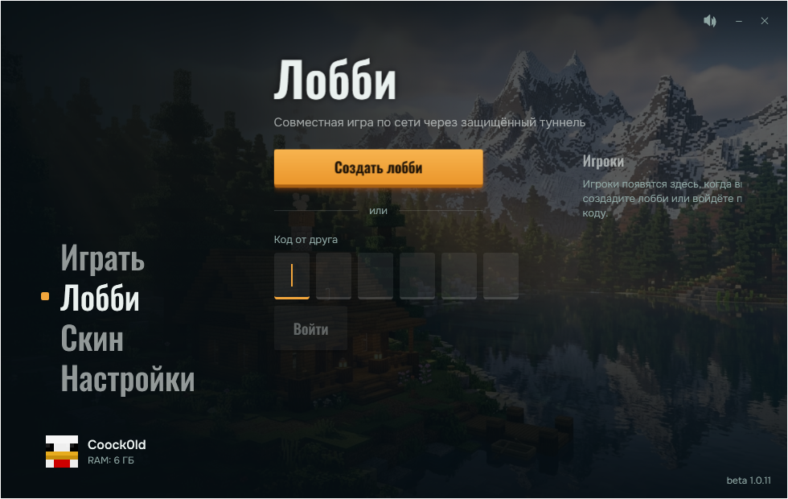
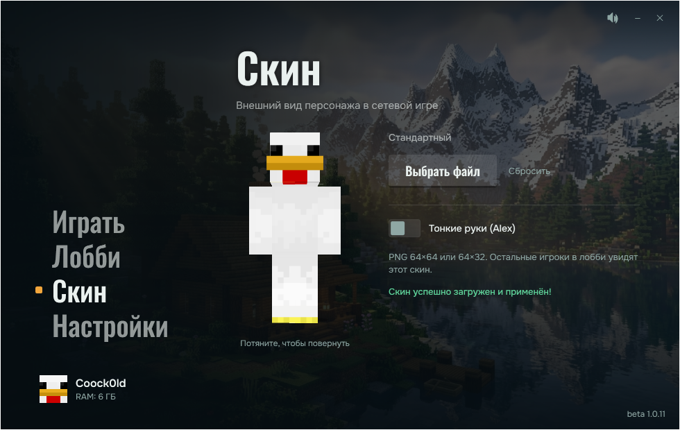
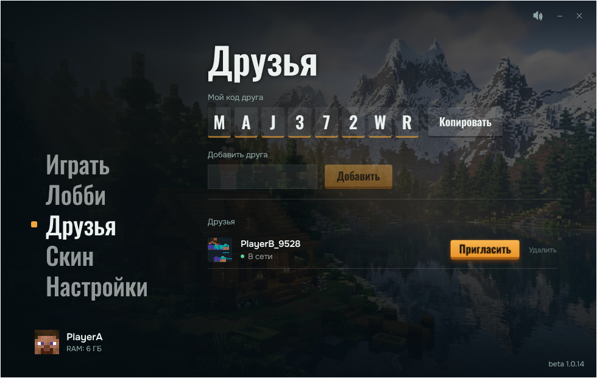
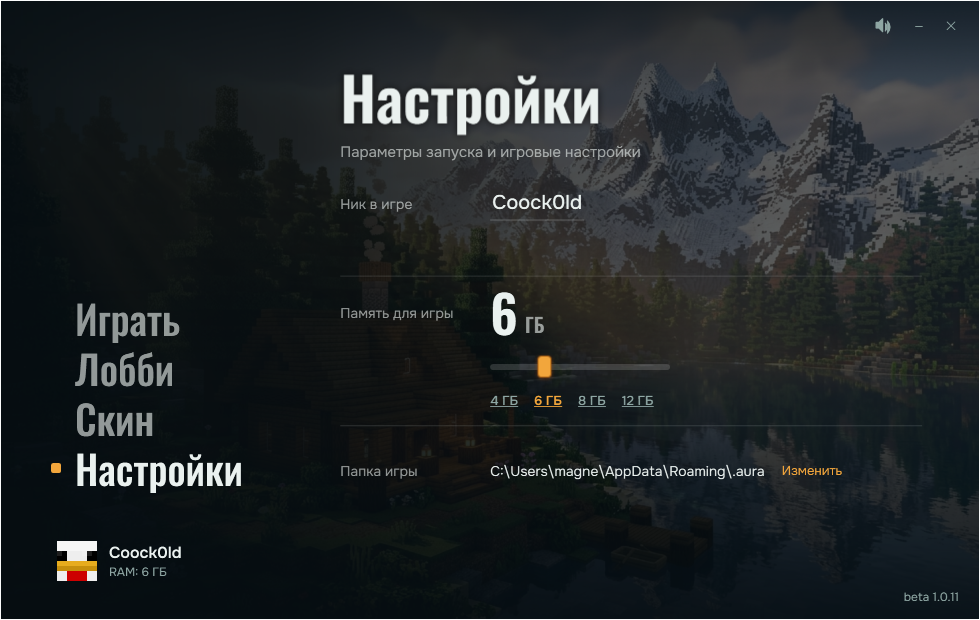
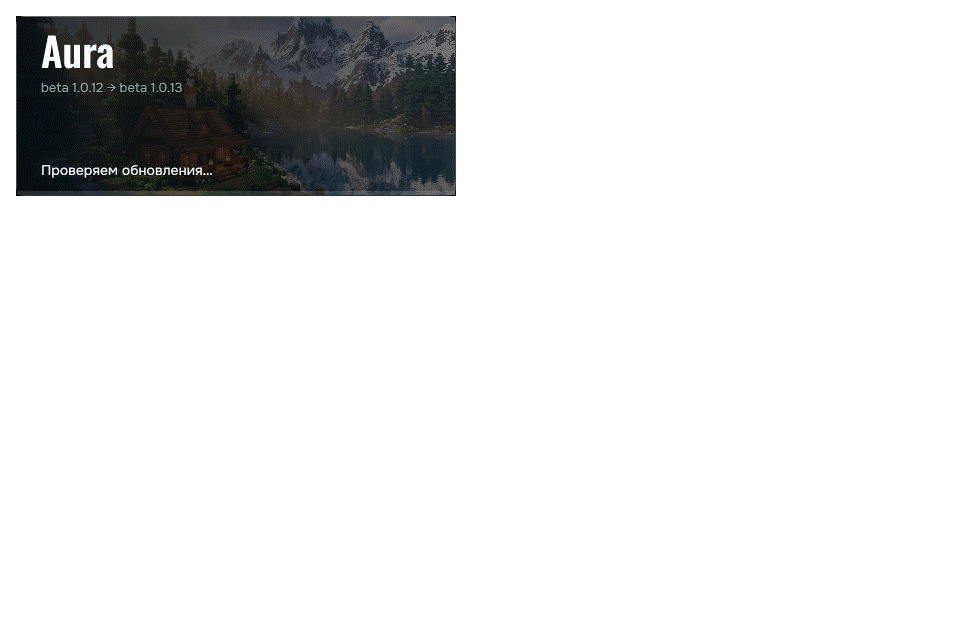
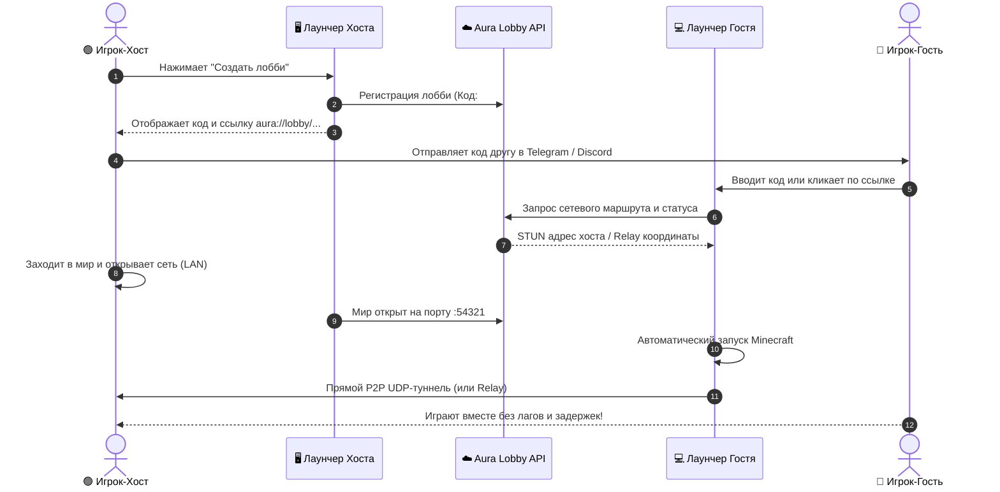
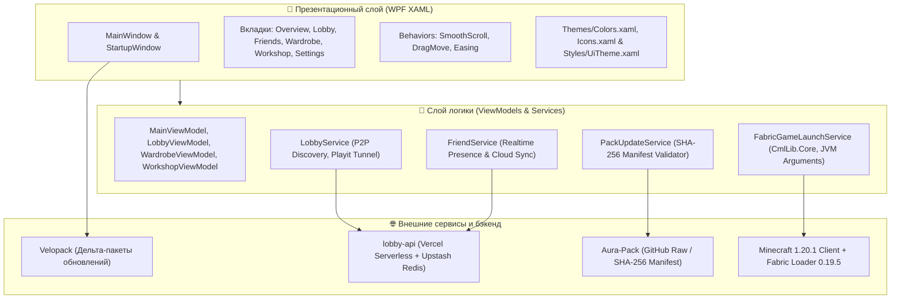

<div align="center">

  

  # ⚡ Aura Launcher

  **Следующее поколение Minecraft-лаунчера с P2P-мультиплеером без настройки, встроенной сетью друзей и мгновенными дельта-обновлениями**

  *The next-generation Minecraft launcher featuring zero-config peer-to-peer multiplayer, integrated friends system, 3D skin studio, and seamless delta updates.*

  <br />

  [](https://github.com/qutlawsoasis-debug/Aura-Launcher/releases/latest)
  [](https://github.com/qutlawsoasis-debug/Aura-Launcher/releases/latest)
  [](https://dotnet.microsoft.com/)
  [](https://fabricmc.net/)
  [](https://velopack.io)
  [](LICENSE)

  <br />

  [ ✨ Возможности ](#-ключевые-возможности) • 
  [ 🚀 Быстрый старт ](#-быстрый-старт) • 
  [ 📸 Скриншоты ](#-галерея-интерфейса) • 
  [ 🌐 P2P Сеть ](#-как-работает-p2p-мультиплеер) • 
  [ 🏗️ Архитектура ](#-архитектура-проекта) • 
  [ ❓ FAQ ](#-частые-вопросы-faq)

  <br />

  

</div>

---

## 📖 О проекте / About

**Aura Launcher** — это высокопроизводительный современный лаунчер Minecraft, созданный с нуля для комфортной совместной игры. Больше не нужно настраивать Hamachi, Radmin VPN, пробрасывать порты роутера или вручную пересылать друзьям архивы с модами.

Aura решает все эти проблемы в один клик: запускайте мир, отправляйте другу короткий код комнаты, и играйте с минимальным пингом и автоматической синхронизацией сборки модов.

---

## ✨ Ключевые возможности

### ⚡ P2P Мультиплеер без настроек (Aura Connect)
- **Никаких VPN и проброса портов**: Прямое P2P-соединение между игроками через STUN/UPnP с автоматическим переключением на высокоскоростной Relay-сервер при строгом NAT.
- **Мгновенные приглашения**: 6-значные коды комнат (например, `#A9B2C1`) и кликабельные глубокие ссылки (`aura://lobby/join?code=...`).
- **Автообнаружение открытого мира**: Хост нажимает «Открыть для сети» в игре — лаунчер мгновенно видит мир и генерирует код подключения.
- **Умное переподключение**: Кнопка «Переподключиться» в лаунчере позволяет мгновенно вернуться в игру при случайном дисконнекте.

### 👥 Встроенная социальная сеть и Друзья
- **Живой онлайн-статус**: Отслеживание статуса друзей в реальном времени («В игре», «В лобби», «В сети», «Был(а) в сети 5 мин. назад»).
- **Вход в 1 клик**: Если друг создал лобби, во вкладке «Друзья» появляется кнопка «Войти», подключающая вас напрямую к его сессии.
- **Мгновенный сброс присутствия**: При выходе из игры или выключении ПК статус моментально обновляется, исключая «призраков» в лобби.

### 👗 Интерактивный 3D-Гардероб (Skin Studio)
- **3D-рендер в реальном времени**: Вращение модельки на 360°, переключение проекций (лицо, профиль, спина).
- **Поддержка моделей Alex (Slim 3px) и Steve (Classic 4px)**.
- **Поддержка скинов 64×64 и 64×32**, а также динамических плащей.
- **Локальный каталог и облачная синхронизация**: Загрузка пользовательских скинов с мгновенным применением в игре без перезапуска.

### 🔄 Бесшовные дельта-обновления (Velopack)
- **Мгновенные патчи**: Обновления скачиваются за секунды через компактные бинарные дельты (размером всего 200 КБ – 2 МБ).
- **Фоновая проверка**: Ненавязчивые системные уведомления Windows при выходе новых версий.
- **Установка в 1 клик**: Быстрый перезапуск с сохранением всех настроек и пользовательских данных.

### 📦 Автосинхронизация модов (Aura-Pack)
- **Всегда актуальная сборка**: Лаунчер автоматически сверяет хеши файлов с официальным репозиторием [Aura-Pack](https://github.com/qutlawsoasis-debug/Aura-Pack).
- **Криптографическая проверка SHA-256**: Гарантия целостности модов, шейдеров и ресурспаков перед каждым запуском.

### 💎 Кинематографичный интерфейс (WPF Dark Glass UI)
- **Плавная физика анимаций**: Кубические кривые сглаживания (`CubicEase`) при переходе между страницами.
- **Кинетический скролл**: Мягкий и естественный скроллинг списков колесом мыши (`SmoothScroll`).
- **Скользящий индикатор меню**: Плавное перемещение неонового маркера по разделам боковой панели.
- **Адаптивная верстка**: Отсутствие прыгающих кнопок и перекрытий текста.

---

## 📸 Галерея интерфейса

<div align="center">

| 🎮 Главный экран запуска | 🌐 Лобби и P2P Мультиплеер |
| :---: | :---: |
|  |  |

| 👗 3D Гардероб и Скины | 👥 Список друзей и Статусы |
| :---: | :---: |
|  |  |

| ⚙️ Настройки и Диагностика | 🔄 Дельта-обновление Velopack |
| :---: | :---: |
|  |  |

</div>

---

## 🚀 Быстрый старт

### Способ 1: Установщик (Рекомендуется)
1. Перейдите на страницу **[Последнего релиза](https://github.com/qutlawsoasis-debug/Aura-Launcher/releases/latest)**.
2. Скачайте файл **`AuraLauncher-win-Setup.exe`**.
3. Запустите установщик. Лаунчер установится за пару секунд и создаст ярлык на рабочем столе с настроенной авто-проверкой обновлений.

### Способ 2: Портативная версия (Portable)
1. Скачайте архив **`AuraLauncher-win-Portable.zip`**.
2. Распакуйте в любую удобную папку (например, `D:\Games\AuraLauncher`).
3. Запустите `AuraLauncher.exe`.

> [!TIP]
> Лаунчер автоматически определяет установленную в системе Java 17+ или использует встроенную среду выполнения.

---

## 🌐 Как работает P2P Мультиплеер



---

## 🏗️ Архитектура проекта

Проект построен по модульным принципам Clean Architecture и MVVM с использованием передовых практик .NET 8:



---

## 🛠️ Сборка из исходников

### Требования:
- **ОС**: Windows 10/11 x64
- **SDK**: [.NET 8.0 SDK](https://dotnet.microsoft.com/download/dotnet/8.0)
- **Инструменты**: Git, PowerShell 5.1+

### Пошаговая сборка:

```powershell
# 1. Клонируйте репозиторий
git clone https://github.com/qutlawsoasis-debug/Aura-Launcher.git
cd Aura-Launcher

# 2. Восстановите зависимости и соберите проект
dotnet restore
dotnet build -c Release

# 3. Запустите модульные тесты и проверку дизайн-системы
dotnet test tests/AuraLauncher.Tests/AuraLauncher.Tests.csproj --filter "Category!=Integration"
.\scripts\check-design.ps1

# 4. Создайте релизный дистрибутив и установщик Velopack
.\scripts\build-release.ps1
```

---

## ❓ Частые вопросы (FAQ)

<details>
<summary><b>Нужна ли лицензия Minecraft для игры?</b></summary>
Aura Launcher поддерживает как авторизованные профили, так и удобный локальный режим с персональным никнеймом и выбором 3D-скина.
</details>

<details>
<summary><b>Почему P2P лучше обычных виртуальных сетей (Hamachi/Radmin)?</b></summary>
Aura Connect устанавливает соединение напрямую без установки виртуальных сетевых драйверов. Это минимизирует сетевой пинг, убирает паразитный оверхед и исключает ограничения по количеству участников в комнате.
</details>

<details>
<summary><b>Как работают дельта-обновления?</b></summary>
Благодаря алгоритмам упаковщика Velopack скачиваются исключительно байтовые различия (diff) между предыдущей и новой версией. Даже крупное обновление весит всего несколько сотен килобайт и применяется почти мгновенно.
</details>

<details>
<summary><b>Где хранятся настройки, моды и логи?</b></summary>
Конфигурация лаунчера, моды и логи игры хранятся в папке <code>%APPDATA%\.aura</code> (конфиг: <code>%APPDATA%\.aura\config.json</code>, логи игры: <code>%APPDATA%\.aura\logs\latest.log</code>, лог лаунчера: <code>%APPDATA%\Aura\launcher.log</code>). Вы также можете в 1 клик сгенерировать полный диагностический отчёт в разделе настроек.
</details>

---

## 🤝 Участие в разработке (Contributing)

Мы рады любым предложениям по улучшению, сообщениям об ошибках и пулл-реквестам!
- Ознакомьтесь с [Руководством разработчика (CONTRIBUTING.md)](CONTRIBUTING.md).
- Создавайте [Issue](https://github.com/qutlawsoasis-debug/Aura-Launcher/issues) для багов и предложений.

---

## 📄 Лицензия

Проект распространяется под открытой лицензией [MIT License](LICENSE).  
Minecraft является зарегистрированным товарным знаком Mojang Synergies AB. Aura Launcher не связан с Mojang AB или Microsoft.

<div align="center">
  <sub>Создано с ❤️ сообществом Aura. Приятной игры!</sub>
</div>
